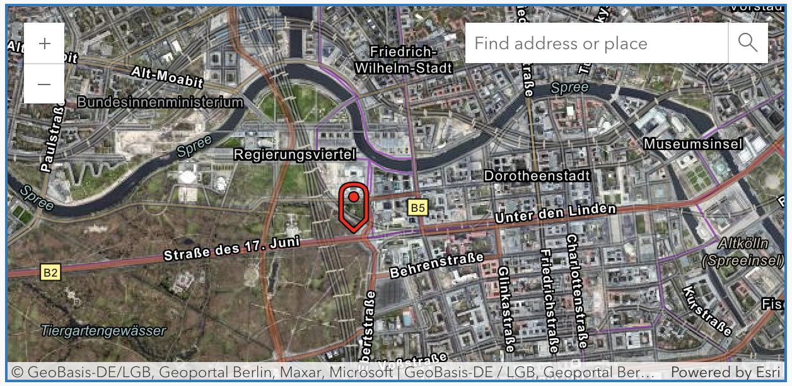

# Esri Map View

Plugin Name:       esri-map-view
Contributors:      geoplay9
Plugin URI:        https://github.com/jf990/esri-map-view-plugin
Description:       Render an ArcGIS map on a WordPress page. Use any Esri basemap, public layers, public web map or web scene.
Tags:              maps, arcgis, esri, location, scene, globe, points, layers, markers, google maps
Version:           1.2.2
Stable tag:        1.2.2
Requires at least: 5.2
Tested up to:      6.6
Requires PHP:      7.0
Author:            John Foster
Author URI:        https://github.com/jf990/
License:           MIT
License URI:       https://github.com/jf990/esri-map-view-plugin/blob/master/LICENSE
Text Domain:       esri-map-view-plugin
GitHub Plugin URI: https://github.com/jf990/esri-map-view-plugin
GitHub Branch:     main

Render an Esri ArcGIS map on a WordPress page. Use any Esri basemap, public layers, public web map or web scene.

## Description

This Esri maps plugin enables you to display Esri/ArcGIS maps or scenes with shortcodes in your WordPress posts. Select a basemap, set an initial viewpoint, add your custom layers, show information in a pop-up, and more. Or start with a pre-configured web map or web scene. You can also add a search widget to the map.

This is based on the custom web component [esri-map-view](https://github.com/jf990/esri-map-component).

## Features

* Use Esri's world-renowned authoritative map services in your WordPress blog.
* Select from any Esri basemap.
* Set an initial viewpoint and zoom level.
* Add a marker and pop-up to the initial viewpoint.
* Add a search widget to your map or scene.
* Display map on posts/pages using the WordPress shortcode syntax.
* Set your map height and width.
* Set map zoom level.

This plugin uses a 3rd party service provided by [Esri](https://esri.com). No personal identifiable information or telemetry data is recorded. Esri takes the responsibility to protect your privacy seriously. Esri holds itself to the highest national and international standards, including [Privacy Shield certification](https://www.privacyshield.gov/participant?id=a2zt00000004EspAAE) and GDPR compliance. View the [privacy policy](https://www.esri.com/en-us/privacy/overview).



## Installation

1. Download the plugin archive and unzip it.
1. Copy the __esri-map-view__ plugin folder to your WordPress `/wp-content/plugins/` folder. There should now be a new folder named `/wp-content/plugins/esri-map-view/`.
1. Log in to WordPress and go to __Plugins__.
1. Find the __esri-map-view__ plugin and click __Activate Plugin__.

## Usage

1. On any _page_ or _post_, add a new block, then select `[/]` shortcode.
1. Use either `esri-map-view` or `esri-scene-view` shortcode, as follows. All attributes except `height` are optional.

### Map

```txt
[esri-map-view height="900px" basemap="arcgis/imagery" viewpoint="13.3761697,52.5166449,15" layers="d3e5c29f5e404aa4b2de29a9f0e37996" search="top-right" symbol="pin:red" symboloffset="0,0" popuptitle="Brandenburg Gate" popupinfo="This is a historic place you should visit" apikey="YOUR_API_KEY"][/esri-map-view]
```

* `esri-map-view` opening shortcode tag for a 2D map.
* `height`: indicate the height you want for your map. You must provide a height. The width will automatically scale to the full page width of your page or post.
* `apikey`: include your [API key](https://developers.arcgis.com/documentation/security-and-authentication/api-key-authentication/api-key-credentials/) to authenticate service requests with ArcGIS services.
* `basemap`: indicate the basemap style you want to use. Select from [available basemap styles](https://developers.arcgis.com/rest/basemap-styles/#arcgis-styles). This is optional and will default to __osm/standard__. This attribute is ignored if `webmap` is set.
* `webmap`: select an ArcGIS web map item ID. If this is provided the `basemap` attribute is ignored.
* `viewpoint`: Indicate an initial viewpoint to focus the map. This is a string of 3 comma-separated numbers expected: latitude (y), longitude (x), and levelOfDetail (LOD). Example: "22.7783,34.1234,9". You should set this if you set a `basemap`. You do not need to set this if you set `webmap` as the web map's initial viewpoint would be used. If you do set `viewpoint` and `webmap` then this setting will override the initial viewpoint of the web map.
* `layers`: Select layers to add on top of the map using either full URL to the feature service on an ArcGIS server (must be public) or the ArcGIS Online item ID of a public layer. Multiple layers are separated with comma `,`.
* `symbol`: Indicate a symbol to use to mark the location of the initial viewpoint. This is the fully qualified URL to a 64x64 px PNG image. CORS is respected when accessing the image. You can also specify `green-pin` to use a green map pin as the symbol.
* `popupinfo`: If `symbol` is set, tapping the image will show a pop-up. This is the `content` for that pop-up.
* `popuptitle`: If `symbol` is set, tapping the image will show a pop-up. This is the `title` for that pop-up.
* `search`: Include a search widget by indicating where on the map view it should appear. The valid values for this attribute are `top-left`, `top-right`, `bottom-left`, `bottom-right`. If this attribute is empty/missing or an invalid value then a search widget will not show.
* `[/esri-map-view]`: Closing tag is required. Do not forget the closing tag!

### Scene

```txt
[esri-scene-view height="900px" basemap="arcgis/imagery" viewpoint="13.3761697,52.5166449,15" layers="d3e5c29f5e404aa4b2de29a9f0e37996" search="top-right" symbol="pin:red" symboloffset="0,0" popuptitle="Brandenburg Gate" popupinfo="This is a historic place you should visit" apikey="YOUR_API_KEY"][/esri-scene-view]
```

* `esri-scene-view` opening shortcode tag for a 3D globe.
* `height`: indicate the height you want for your map. You must provide a height. The width will automatically scale to the full page width of your page or post.
* `apikey`: include your [API key](https://developers.arcgis.com/documentation/security-and-authentication/api-key-authentication/api-key-credentials/) to authenticate service requests with ArcGIS services.
* `basemap`: indicate the basemap style you want to use. Select from [available basemap styles](https://developers.arcgis.com/rest/basemap-styles/#arcgis-styles). This is optional and will default to __osm/standard__. This attribute is ignored if `webmap` is set.
* `webscene`: select an ArcGIS web scene item ID. If this is provided the `basemap` attribute is ignored.
* `cameraposition`: Indicate the camera position for the initial scene viewpoint. This is a string of five comma separated numbers as follows: x,y,z,heading,tilt. If you set this it will override `viewpoint` settings.
* `viewpoint`: Indicate an initial viewpoint to focus the map. This is a string of 3 comma-separated numbers expected: latitude (y), longitude (x), and levelOfDetail (LOD). Example: "22.7783,34.1234,9". You should set this if you set a `basemap`. You do not need to set this if you set `webscene` as the web scene's initial viewpoint is used. However, this setting will override the web scenes initial viewpoint. The `viewpoint` is not used if `cameraPosition` is also set. For 3D scenes, the level of detail is translated into a 3D camera position height of Z-axis position.
* `layers`: Select layers to add on top of the map using either full URL to the feature service on an ArcGIS server (must be public) or the ArcGIS Online item ID of a public layer. Multiple layers are separated with comma `,`.
* `symbol`: Indicate a symbol to use to mark the location of the initial viewpoint. This is the fully qualified URL to a 64x64 px PNG image. CORS is respected when accessing the image. You can also specify `green-pin` to use a green map pin as the symbol.
* `popupinfo`: If `symbol` is set, tapping the image will show a pop-up. This is the `content` for that pop-up.
* `popuptitle`: If `symbol` is set, tapping the image will show a pop-up. This is the `title` for that pop-up.
* `search`: Include a search widget by indicating where on the map view it should appear. The valid values for this attribute are `top-left`, `top-right`, `bottom-left`, `bottom-right`. If this attribute is empty/missing or an invalid value then a search widget will not show.
* `[/esri-scene-view]`: Closing tag is required. Do not forget the closing tag!

## License

[MIT License Copyright (c) 2019 John Foster](./esri-map-view/LICENSE)

## Changelog

See [Change log](./esri-map-view/CHANGELOG.md).
